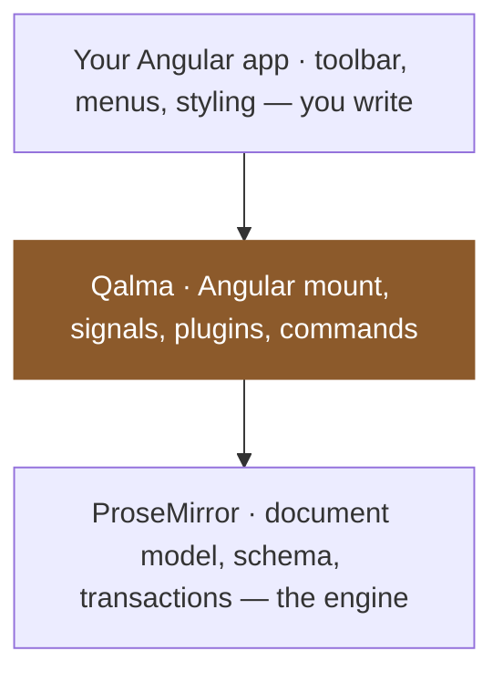

# Introduction

Qalma is a headless, plugin-based rich text editor for Angular, built on
[ProseMirror](https://prosemirror.net/). It ships no styling and no opinions
about your UI — you bring the components, Qalma brings the editing engine.

## Why Qalma

Most rich text editors for Angular are either thin wrappers around a
JavaScript library with an awkward API surface, or full UI kits you can't
easily restyle. Qalma takes a different approach:

- **Headless by default.** The editor exposes content, commands and state.
  Toolbars, menus and node views are plain Angular components you write (or
  copy from the playground) and style with Tailwind.
- **Plugin-based.** Every feature — headings, lists, links, mentions, code
  blocks, history — is a separate plugin you opt into. Nothing you don't use
  ships in your bundle.
- **Angular-native.** Built with standalone components, signals and
  `provideZonelessChangeDetection()`. The editor state is exposed as
  signals, not `EventEmitter` soup.
- **ProseMirror underneath.** You get a battle-tested document model,
  schema-driven validation, and an ecosystem of ideas to draw from — without
  having to write ProseMirror plugins by hand for common needs.

## Why not just use ProseMirror directly?

You can — ProseMirror _is_ the engine Qalma runs on. But ProseMirror is a
low-level toolkit, not a ready-made editor. In an Angular app, Qalma is the
integration layer in the middle that you would otherwise build by hand:

That middle layer is real work. Here is what you write yourself with raw
ProseMirror versus what Qalma already provides:

| What you deal with | Raw ProseMirror | Qalma |
| ------------------ | --------------- | ----- |
| Angular mount | Wire `EditorView` by hand; keep it SSR- and zoneless-safe | Built into the controller |
| Reading state | Listen to every transaction and re-derive | Signals: `html`, `isCommandActive`, `query` |
| Schema & plugins | Assemble the schema, keymaps, input rules, history | Composable plugins, ordered for you |
| Driving the editor | Roll your own command registry | `execute` / `canExecute` / `qalmaCommand` |
| Common features | Build links, tables, slash menu, markdown rules | Opt-in plugins |

In short: with raw ProseMirror you write the editor _and_ the Angular plumbing
every time; with Qalma you write only your UI. ProseMirror stays the engine
underneath, so you keep its document model and correctness without assembling
them by hand.

## How the pieces fit together

A Qalma editor is composed from three layers:

1. **`QalmaEditorController`** — creates and owns the ProseMirror
   `EditorView`, exposes the document as signals, and runs the plugins you
   register.
2. **Plugins** (`QalmaPlugin`) — each plugin contributes schema nodes/marks,
   keymaps, input rules and commands. The
   [Core Concepts](/docs/architecture) section covers how they're composed.
3. **Your UI** — a toolbar, the content surface (`&lt;qalma-content&gt;`), and any
   popovers or menus (link editor, mention list, slash menu...) are regular
   Angular components that read from the controller and call its commands.

## Where to go next

- [Installation](/docs/installation) — add `@qalma/editor` to your project.
- [Quick Start](/docs/quick-start) — wire up a minimal editor in a few lines.
- [Plugins](/docs/plugins) — browse the full plugin reference.
- [Live Playground](/#playground) — try the editor right now, in your
  browser.
